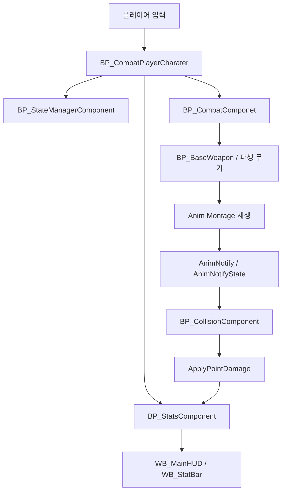

# SoulsLike 5.7 - Blueprint Combat Prototype

Unreal Engine 5.7 기반의 3인칭 소울라이크 전투 프로토타입이다. 이 저장소는 C++ 코드가 없는 content-only 프로젝트이며, 핵심 전투 로직은 `Content/CombatSystem` 아래의 Blueprint 에셋으로 구현되어 있다.

공개 저장소의 목적은 완성된 상용 게임 배포가 아니라, Blueprint만으로 전투 입력, 상태 제어, 무기 장착, 공격 판정, 스탯 갱신, HUD 반영까지 이어지는 구조를 보여주는 포트폴리오용 구현 범위다.

## 구현 범위

- 플레이어 이동, 카메라, 점프, 스프린트, 걷기 전환 입력 처리
- 약공격, 강공격, 차지 공격, 낙하 공격, 스프린트 공격, 회피 액션 흐름
- 전투 모드 진입/해제와 무기 소켓 장착 처리
- 무기별 Anim Montage 선택과 콤보 진행
- Animation Notify 기반의 공격 가능 구간, 회전 보정, 무기 충돌 활성화
- Sphere Trace 기반 무기 충돌 판정과 중복 피격 방지
- 체력/스태미나 스탯 관리, 스태미나 재생, 사망 상태 전환
- HUD 위젯을 통한 체력/스태미나 바 갱신
- 상호작용 인터페이스와 커스텀 `Interactable` 충돌 채널

## 프로젝트 구성

| 경로 | 역할 |
| --- | --- |
| `SoulsLike.uproject` | Unreal Engine 5.7 프로젝트 파일 |
| `Config/DefaultEngine.ini` | 기본 맵, 기본 GameMode, 렌더링 설정, 커스텀 충돌 채널 설정 |
| `Config/DefaultInput.ini` | 공격, 회피, 스프린트, 상호작용 등 레거시 입력 매핑 |
| `Config/DefaultGameplayTags.ini` | 전투 액션과 캐릭터 상태를 표현하는 GameplayTag 목록 |
| `Content/Maps/ThirdPersonMap.umap` | 기본 실행 맵 |
| `Content/CombatSystem/Blueprints` | 캐릭터, 컨트롤러, 전투 컴포넌트, 무기, 인터페이스 Blueprint |
| `Content/CombatSystem/Input` | Enhanced Input용 이동/시점/점프 Input Action과 Mapping Context |
| `Content/CombatSystem/UI` | HUD와 스탯 바 위젯 |

## 전체 전투 흐름



1. 입력은 `BP_CombatPlayerCharater`에서 받아 이동, 공격, 회피, 전투 전환 같은 액션으로 분기한다.
2. 캐릭터는 `BP_StateManagerComponent`의 현재 상태와 현재 액션을 확인해 실행 가능 여부를 판단한다.
3. 공격이 가능하면 `BP_CombatComponet`에서 현재 장착 무기인 `MainWeapon`을 가져와 무기 Blueprint 쪽 공격 로직을 호출한다.
4. `BP_BaseWeapon`은 현재 액션에 맞는 Anim Montage를 선택하고, 공격별 데미지 배율과 스탯 소모량을 적용한다.
5. Montage 안의 Notify가 특정 프레임 구간에서 충돌 판정을 켜고 끈다.
6. `BP_CollisionComponent`는 소켓 위치 기반 Sphere Trace로 피격 대상을 찾고, 이미 맞은 액터는 `AlreadyHitActors`로 중복 적용을 막는다.
7. 피격이 확정되면 `ApplyPointDamage`로 데미지를 전달하고, 스탯 변경은 `BP_StatsComponent`와 HUD 이벤트로 이어진다.

## 핵심 Blueprint 설명

### `BP_CombatPlayerCharater`

플레이어 캐릭터의 중심 Blueprint다. 이동 입력, 카메라 입력, 공격 입력, 회피, 스프린트, 걷기 전환, 상호작용, 전투 모드 전환을 처리한다.

주요 책임은 다음과 같다.

- `IA_Move`, `IA_Look`, `IA_Jump` 기반의 Enhanced Input 처리
- `LightAttack`, `Heavy Attack`, `Dodge`, `Sprint`, `ToggleCombat`, `ToggleWalk`, `Interact` 입력 처리
- `CanPerformAttack`, `CanPerformDodge`, `CanPerformSprint`, `CanPerformToggleCombat`로 현재 상태에서 액션 실행 가능 여부 판단
- `PerformAttack`, `PerformDodge`, `ResetAttack`, `ResetCombat`, `ContinueAttack` 같은 전투 이벤트 실행
- 공격 버튼을 누른 시간(`AttackHeldTime`)을 이용한 차지 공격 판단
- 이동 상태를 `Walking`, `Sprinting`, 기본 조깅 상태로 전환
- `SphereTraceSingleForObjects`와 `Interactable_BPI`를 이용한 상호작용 대상 탐색
- `Tab` 입력 노드를 통한 타겟팅/락온 관련 처리
- `ReceivePointDamage`에서 피해를 받아 `BP_StatsComponent`로 체력 변경 전달

캐릭터 Blueprint는 직접 모든 전투 처리를 들고 있지 않고, 상태/전투/스탯 기능을 컴포넌트로 나눠 호출한다. 그래서 입력과 캐릭터 조작은 캐릭터에 남기고, 상태 관리와 데미지/스태미나 계산은 별도 컴포넌트가 담당한다.

### `BP_CombatPlayerController`

플레이어 컨트롤러는 HUD 초기화 쪽 책임을 가진다. `WB_MainHUD`를 생성해 화면에 붙이고, 캐릭터의 스탯 변경이 UI에 반영될 수 있는 기본 표시 계층을 만든다.

### `BP_StateManagerComponent`

GameplayTag 기반 상태 관리자다. 현재 캐릭터 상태와 현재 캐릭터 액션을 관리한다.

사용되는 대표 태그는 다음과 같다.

- `Character.Action.Attack.Light Attack`
- `Character.Action.Attack.Heavy Attack`
- `Character.Action.Attack.Charge Attack`
- `Character.Action.Attack.Falling Attack`
- `Character.Action.Attack.Sprint Attack`
- `Character.Action.Dodge`
- `Character.Action.Enter Combat`
- `Character.Action.Exit Combat`
- `Character.State.Attacking`
- `Character.State.Dodging`
- `Character.State.Disabled`
- `Character.State.Dead`

주요 기능은 다음과 같다.

- `SetState`로 현재 상태 변경
- `SetCurrentAction`으로 현재 실행 액션 변경
- `ResetState`로 상태 초기화
- `GetCurrentState`, `GetCurrentAction` 조회
- `IsCurrentStateEqualToAny`, `isCurrentActionEqualToAny`로 액션 가능 조건 검사
- `OnStateBegin`, `OnStateEnd`, `OnCharacterActionBegin`, `OnCharacterActionEnd` 이벤트 발행

이 컴포넌트 덕분에 공격 중 회피, 사망 중 입력, 회피 중 추가 공격처럼 서로 충돌할 수 있는 액션을 태그 단위로 제어할 수 있다.

### `BP_CombatComponet`

전투 장착 상태와 현재 무기를 관리하는 컴포넌트다. 파일명은 프로젝트 내부 표기 그대로 `Componet`으로 되어 있다.

주요 기능은 다음과 같다.

- `CombatEnabled?`로 전투 모드 여부 저장
- `MainWeapon` 참조 관리
- `SetMainWeapon`, `GetMainWeapon`으로 장착 무기 갱신/조회
- `SetCombatEnabled`, `IsCombatEnabled?`로 전투 모드 제어
- `UpdateCombatEnabled`를 `Animinstance_BPI`로 전달해 Animation Blueprint 쪽 전투 상태와 동기화
- `ResetAttack`으로 저장된 공격 입력과 콤보 상태 초기화

캐릭터는 공격 시 이 컴포넌트를 통해 현재 무기를 찾는다. 무기 교체나 전투 모드 전환이 캐릭터 Blueprint에 강하게 묶이지 않도록 분리한 구조다.

### `BP_StatsComponent`

체력과 스태미나를 관리하는 컴포넌트다. `F_BaseStat` 구조체와 `E_Stats` enum을 사용해 스탯을 맵 형태로 관리한다.

관련 데이터는 다음과 같다.

- `E_Stats`: `Health`, `Stamina`
- `F_BaseStat`: `Base Value`, `Max Value`
- `BaseStats`: 기본 스탯 값
- `CurrentStats`: 현재 스탯 값

주요 기능은 다음과 같다.

- `IntializeStats`로 기본 스탯을 현재 스탯에 반영
- `GetBaseStatValue`, `GetMaxStatValue`, `GetCurrentStatValue` 조회
- `ModifyCurrentStatValue`로 체력/스태미나 증감
- `RegenStamina`로 스태미나 재생
- 체력이 0 이하가 되면 `Character.State.Dead` 상태 적용
- `OnCurrentStatValueUpdated` 이벤트로 HUD에 변경사항 전달

공격, 회피, 스프린트 같은 액션은 스태미나 소모와 연결되고, 피해 이벤트는 체력 감소와 연결된다. 이 로직이 컴포넌트로 분리되어 있어 UI와 캐릭터 입력이 직접 스탯 계산을 들고 있지 않다.

### `BP_CollisionComponent`

무기 충돌 판정을 담당하는 ActorComponent다. 공격 애니메이션이 진행되는 동안 지정된 소켓 구간을 추적해 피격 대상을 찾는다.

주요 기능은 다음과 같다.

- `ActivateCollision`, `DeactivateCollision`로 충돌 판정 활성화/비활성화
- `CollisionTrace`에서 `SphereTraceMultiForObjects` 실행
- `Start Socket Name`, `End Socket Name` 기준으로 무기 궤적 판정
- `AlreadyHitActors` 배열로 같은 공격 구간 안에서 중복 피격 방지
- `ClearHitActors`로 다음 공격 구간을 위한 피격 목록 초기화
- `OnHit` 이벤트로 무기 Blueprint에 피격 결과 전달

항상 충돌을 켜두는 방식이 아니라, AnimNotifyState가 열어준 짧은 공격 구간에서만 Trace를 실행한다. 이 방식은 소울라이크식 근접 전투에서 애니메이션 타이밍과 판정을 맞추기 좋다.

## 무기 Blueprint 구조

### `BP_BaseEquippable`

장착 가능한 아이템의 공통 부모다.

- `ItemStaticMesh`로 표시용 메시 보유
- `AttachActor`로 캐릭터 Mesh의 소켓에 부착
- `Attach Socket Name`으로 등/손 같은 장착 위치 지정
- `IsEquipped?`, `SetIsEquipped`, `OnEquipped`, `OnUnequipped`로 장착 상태 관리
- 기본 충돌은 장착 중 방해되지 않도록 `NoCollision` 기준으로 설정

### `BP_BaseWeapon`

실제 전투 무기의 공통 부모다. `BP_BaseEquippable`을 확장해 공격 Montage, 데미지, 충돌, 전투 타입을 관리한다.

주요 데이터와 기능은 다음과 같다.

- `CombatType`: `None`, `LightSword`, `GreatSword`, `DualSwords`
- `BaseDamage`: 기본 데미지
- `ActionDamageMultiplier`: 액션별 데미지 배율
- `ActionStatCost`: 액션별 스태미나 비용
- `Light Attack Montages`, `Heavy Attack Montages`, `Charge Attack Montages`, `Falling Attack Montages`, `Sprint Attack Montages`, `DodgeMontages`
- `GetDamage`로 현재 액션에 맞는 최종 데미지 계산
- `CanRecieveDamage`로 피격 가능 여부 확인
- `ApplyPointDamage`로 실제 데미지 전달
- `EnableCombat`, `EnterCombat`, `ExitCombat`로 전투 상태와 무기 표시 상태 전환
- `BP_CollisionComponent`의 `OnHit` 이벤트를 받아 피격 처리

무기마다 공격 애니메이션과 전투 타입이 다르지만, 데미지 적용과 충돌 이벤트 처리 방식은 부모 Blueprint에서 공통화되어 있다.

### `BP_BaseDualWeapon`

쌍검처럼 좌우 무기 또는 발차기 판정까지 필요한 무기를 위한 확장 Blueprint다.

- 메인 무기와 보조 무기 Mesh를 분리
- `MainWeaponCollisionComponent`, `Off-handWeaponCollisionComponent`, `BP_Rightfoot` 충돌 컴포넌트 사용
- `E_CollisionPart`로 `Main Weapon`, `Off-hand Weapon`, `Right Foot` 판정 구분
- `AttachOff-HandWeapon`으로 보조 무기 소켓 부착

### 파생 무기

| Blueprint | 전투 타입 | 특징 |
| --- | --- | --- |
| `BP_ToughSword` | `LightSword` | 약공격 3연계, 강공격, 차지 공격, 낙하 공격, 스프린트 공격 Montage를 가진 한손검 계열 |
| `BP_GreatSword` | `GreatSword` | 느린 대검 공격 Montage와 전용 장착/해제 Montage를 사용하는 중량 무기 |
| `BP_DualToughSwords` | `DualSwords` | 쌍검 공격, 공중 공격, 돌진 공격, 강공격, 차지 공격, 보조 무기 충돌을 포함한 이도류 계열 |

## Animation Notify 구조

전투 타이밍은 AnimNotify와 AnimNotifyState가 제어한다. 공격 Blueprint에서 모든 타이밍을 직접 계산하지 않고, 애니메이션 구간에 Notify를 심어 실제 판정과 상태 변경을 맞춘다.

| Notify | 역할 |
| --- | --- |
| `CollisionTrace_ANS` | NotifyState 시작 시 무기 충돌을 켜고 종료 시 끈다. `E_CollisionPart`로 메인 무기, 보조 무기, 오른발 판정을 선택한다. |
| `ContinueAttack_AN` | 콤보 입력을 다음 공격으로 이어갈 수 있는 시점을 연다. |
| `ResetAttack_AN` | 공격 입력 저장값과 공격 카운트를 초기화한다. |
| `ResetCombat_AN` | 공격/전투 상태를 기본 상태로 되돌린다. |
| `RotateCharacter_ANS` | 공격 중 캐릭터 회전을 보정해 입력 방향 또는 목표 방향을 향하게 한다. |
| `AttachWeaponAcotr_AN` | 장착/해제 애니메이션 중 무기를 지정 소켓에 붙인다. 파일명은 프로젝트 내부 표기 그대로 `Acotr`로 되어 있다. |
| `ToggleCombat_AN` | 전투 모드 진입/해제 시점에 무기 활성 상태를 바꾼다. |

이 구조 덕분에 공격 판정, 콤보 가능 프레임, 무기 장착 타이밍이 애니메이션 데이터와 함께 관리된다.

## 인터페이스

| Interface | 역할 |
| --- | --- |
| `Combat_BPI` | `ContinueAttack`, `ResetAttack`, `ResetCombat`, `CanRecieveDamage` 같은 전투 공통 호출을 제공한다. |
| `Interactable_BPI` | 상호작용 가능한 액터가 `Interact`를 구현할 수 있게 한다. |
| `Animinstance_BPI` | 전투 활성 여부와 전투 타입을 Animation Blueprint로 전달한다. |

Blueprint 간 직접 캐스팅을 줄이고, 캐릭터, 무기, Animation Blueprint가 필요한 메시지만 주고받도록 만든 구조다.

## UI 구조

### `WB_MainHUD`

메인 HUD 위젯이다. 내부에 체력용 `HealthStatBar`와 스태미나용 `StaminaStatBar`를 배치한다.

### `WB_StatBar`

단일 스탯 바 위젯이다.

- `StatType`으로 체력 또는 스태미나를 선택
- 소유 Pawn에서 `BP_StatsComponent`를 찾음
- `OnCurrentStatValueUpdated` 이벤트를 구독
- 현재값과 최대값을 나눠 ProgressBar 비율 갱신

스탯 계산은 `BP_StatsComponent`가 담당하고, 위젯은 표시와 이벤트 반영에 집중한다.

## 입력

`Config/DefaultInput.ini`에 정의된 주요 입력은 다음과 같다.

| 입력 | 기능 |
| --- | --- |
| `Left Mouse Button` | 약공격 |
| `Alt + Left Mouse Button` | 강공격 |
| `Left Control` | 회피 |
| `Left Shift` | 스프린트 |
| `R` | 전투 모드 전환 |
| `Caps Lock` | 걷기 전환 |
| `F` | 상호작용 |

추가로 `BP_CombatPlayerCharater` 내부에는 `Tab` 입력 노드가 있으며, 타겟팅/락온 관련 처리에 사용된다.

## 공개 저장소 범위

이 저장소는 포트폴리오 공개용으로 정리되어 있으며, 다음 항목은 의도적으로 제외되어 있다.

- `DerivedDataCache`
- `Intermediate`
- `Saved`
- `.vs`
- 빌드/패키징 결과물
- Paragon, Mixamo, Starter VFX, CourseFiles 등 외부 라이선스 또는 샘플 에셋 폴더

`*.uasset`, `*.umap`, 주요 미디어 포맷은 Git LFS로 추적한다. 공개 저장소에 포함된 파일은 Blueprint 구조와 프로젝트 구성을 보여주기 위한 범위이며, 로컬 완성본과 동일한 모든 외부 에셋을 재배포하지 않는다.

## 실행 방법

```powershell
git lfs install
git clone https://github.com/sharknogal/SoulsLike-5.7.git
cd SoulsLike-5.7
```

그 다음 `SoulsLike.uproject`를 Unreal Engine 5.7에서 연다.

라이선스가 있는 외부 에셋은 공개 저장소에서 제외되어 있으므로, 완전한 로컬 실행이 필요하면 원본 라이선스 소스에서 동일한 경로로 복원해야 한다. 이 저장소는 Blueprint 전투 구조와 구현 범위를 확인하는 포트폴리오 문서/코드 저장소로 보는 것이 맞다.
